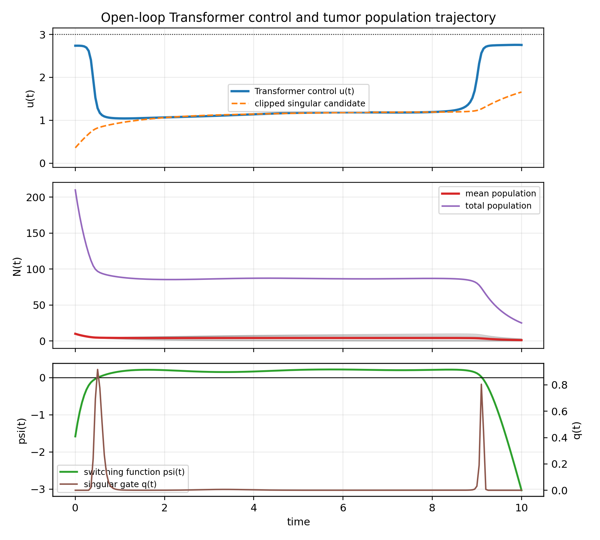
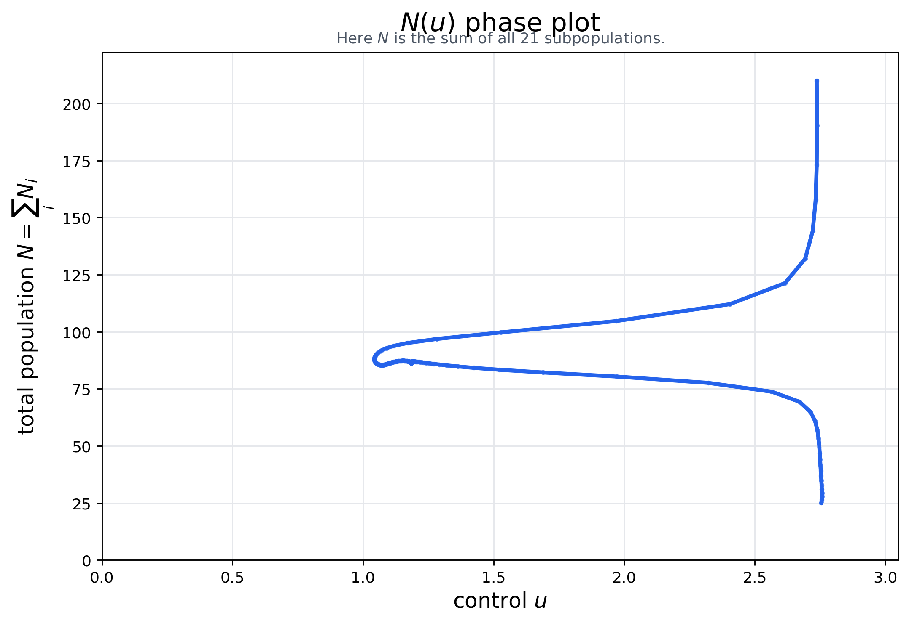
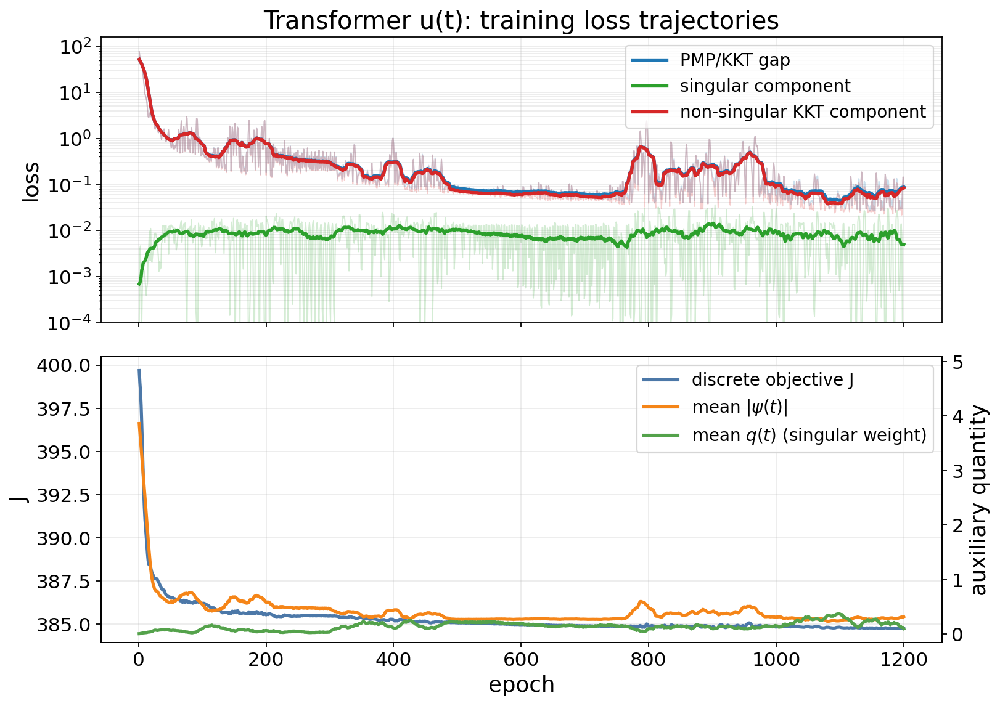
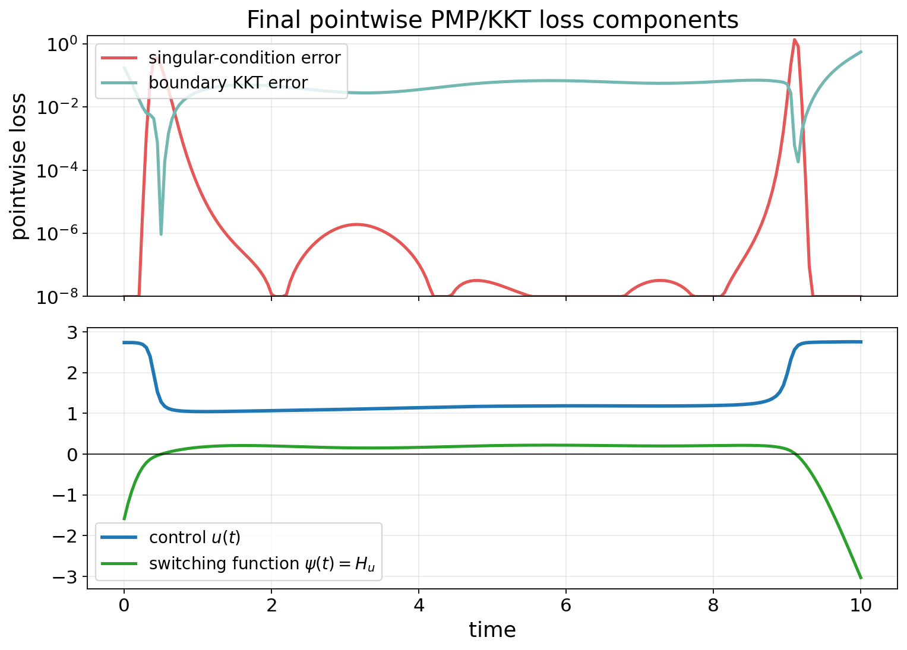
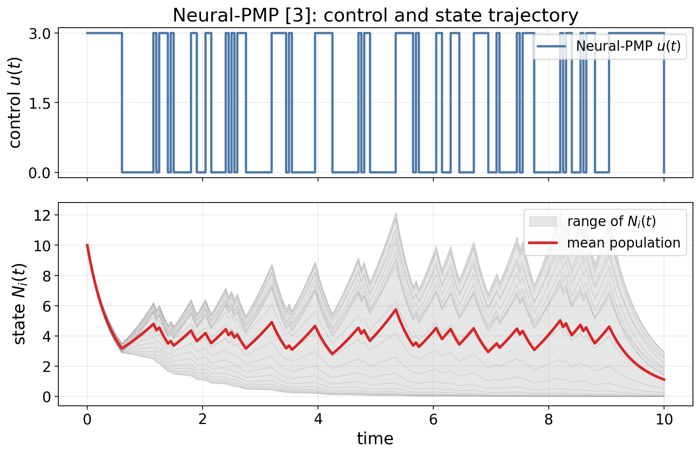
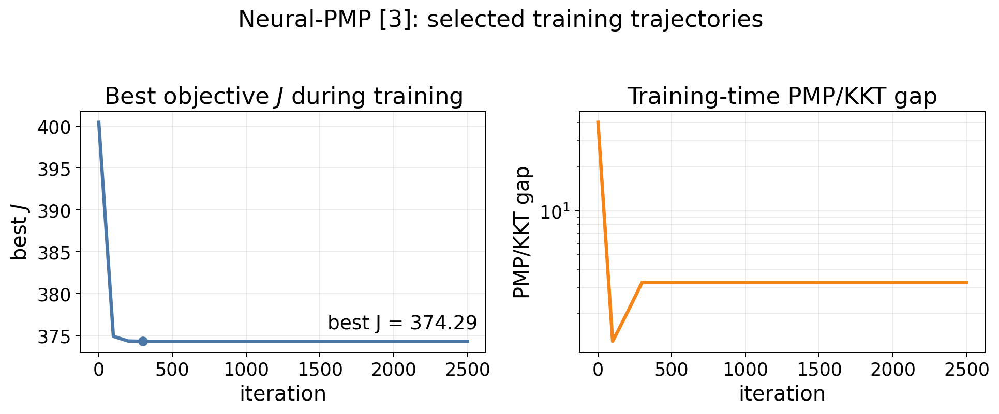
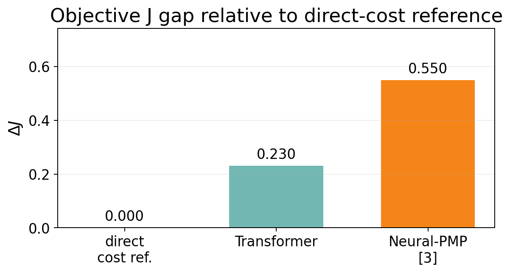

# Transformer \(u(t)\) Experiment Report

This report reproduces the manuscript's time-dependent Transformer control strategy

$$
u_\theta(t):[0,T]\rightarrow [0,u_{\max}],
$$

trained by PMP/KKT optimality gaps.

## 1. Model and Training Objective

We use the population dynamics

$$
\dot N_i(t)=\big(r_i-\phi_i u(t)-M_iG(N(t))\big)N_i(t),
\tag{1}
$$

$$
G(N)=\log\left(1+\frac{1}{m}\sum_{k=1}^m N_k\right),
\tag{2}
$$

and the cost

$$
J(u)=\alpha^\top N(T)+\int_0^T\big(\beta^\top N(t)+\gamma u(t)\big)\,dt.
\tag{3}
$$

For the reported run, \(T=10\), \(m=21\), \(u_{\max}=3\), \(\alpha=1\), \(\beta=0.1\), \(\gamma=20\), and \(N_i(0)=10\). The control is represented by a small Transformer encoder over normalized time.

The training loss follows the manuscript's PMP/KKT optimality-gap formulation. After rolling out \(N_\theta(t)\), we solve the costate equation backward and define

$$
\psi(t)=H_u(N,\lambda,u)
=\gamma-\sum_i\phi_i\lambda_i(t)N_i(t).
\tag{4}
$$

The loss has two optimality-condition components:

| component | role |
|---|---|
| non-singular KKT loss | enforces \(u=0\) when \(\psi>0\), and \(u=u_{\max}\) when \(\psi<0\) |
| singular loss | near \(\psi=0\), matches \(u_\theta(t)\) to the singular candidate \(u_{\mathrm{sing}}(N(t))\) |

The total training loss is

$$
\mathcal L
=
\operatorname{mean}\left[
q(t)(u_\theta(t)-u_{\mathrm{sing}}(t))^2
+(1-q(t))\ell_{\mathrm{KKT}}(t)
\right]
+10^{-4}\operatorname{mean}\big[(u_{k+1}-u_k)^2\big].
$$

Here \(q(t)\) is a smooth weight that switches between the singular condition near \(\psi(t)=0\) and the boundary KKT condition away from \(\psi(t)=0\).

## 2. Learned \(u(t)\) and \(N(t)\)

The learned control starts high, transitions to a lower interior/singular-like region, and increases again near the terminal portion. The state trajectory decreases substantially from the initial population.

*Figure 1. Learned Transformer control \(u(t)\), population trajectory \(N(t)\), switching function \(\psi(t)\), and singular weight \(q(t)\).*

The \(N(u)\) phase plot below uses the total population across all 21 subpopulations.

*Figure 2. \(N(u)\) phase plot using the total population across the 21 subpopulations.*

## 3. Training Loss Trajectories for PMP/KKT Conditions

The table reports the smallest recorded training loss. In this experiment, the training loss is the manuscript's PMP/KKT optimality gap, composed of the singular condition and the non-singular Hamiltonian minimization condition.

| metric | value |
|---|---:|
| total training loss / PMP-KKT optimality gap | 0.02637 |
| singular-condition training loss | 0.00167 |
| non-singular Hamiltonian-minimization training loss | 0.02471 |
| objective \(J\) on the training grid | 384.76 |
| range and mean of \(u_\theta(t)\) | min 1.038, max 2.758, mean 1.372 |
| terminal mean state | 1.207 |

The trajectory separates the two optimality conditions in the manuscript. When \(\psi(t)\approx0\), the singular condition is active; when \(\psi(t)\neq0\), the non-singular Hamiltonian minimization condition pushes the control to the appropriate boundary \(0\) or \(u_{\max}\). The singular-condition gap is small, while the remaining error mainly comes from the non-singular Hamiltonian-minimization condition, especially near switching regions.

*Figure 3. Training trajectories of the total PMP/KKT optimality gap and its singular and non-singular components.*

The next plot shows pointwise PMP/KKT diagnostics along the final learned trajectory. The smooth weight \(q(t)\) separates the two regimes: near \(\psi(t)=0\), the plot emphasizes the singular-condition error; away from \(\psi(t)=0\), it emphasizes the boundary KKT error.

*Figure 4. Pointwise singular-condition error and boundary KKT error along the final learned trajectory.*

## 4. Comparison With Gu et al. [3]

Here [3] refers to Gu, Xiong, and Chen, *Pontryagin Optimal Control via Neural Networks* (arXiv:2212.14566). Their Neural-PMP method contains two parts: learning a differentiable dynamics model from data, and then using a PMP-gradient update to optimize the control sequence. Since the dynamics are known in our manuscript setting, we compare against an oracle-dynamics version of the second part: forward state integration, backward costate recursion, and Hamiltonian-gradient updates of a discrete control sequence. This row should therefore be read as a controller-stage baseline following [3].

| method | control update / training criterion | PMP/KKT gap | objective \(J\)[^1] | note |
|---|---|---:|---:|---|
| Transformer \(u_\theta(t)\) | paper PMP/KKT optimality-gap loss | 0.0523 | 386.70 | main \(u(t)\) reproduction |
| Neural-PMP controller-stage baseline [3] | Hamiltonian-gradient update of control sequence with known dynamics | 7.47 | 387.02 | related-work comparison |
| direct grid cost minimization | minimize discretized \(J\) | 0.805 | 386.47 | reference only |
| constant \(u=1.5\) | fixed control | 76.89 | 400.40 | scale check |

Under the same PMP/KKT gap calculation, the Transformer \(u_\theta(t)\) has a much smaller gap than this Neural-PMP controller-stage baseline. When \(J\) is recomputed with the same numerical evaluator, the Transformer also has a slightly lower objective value in this run.

[^1]: The \(J\) values in this table are computed after fixing \(u(t)\), reintegrating \(N(t)\) with a finer-step fourth-order Runge-Kutta method, and then applying the manuscript objective definition. This is only to use the same numerical integration accuracy across methods.

*Figure 5. Neural-PMP controller-stage baseline [3]: control sequence and resulting state trajectory.*

*Figure 6. Neural-PMP controller-stage baseline [3]: selected-run training trajectories.*

*Figure 7. Objective \(J\) gap relative to the direct-cost reference under the common numerical evaluation.*

## 5. Conclusion

The requested \(u(t)\) reproduction is complete. The Transformer control trajectory trained with the manuscript's PMP/KKT optimality-gap loss is smooth and satisfies the control bounds, reduces the training optimality gap from 76.26 to 0.02637, and gives \(J\approx386.70\) under the common numerical evaluation.

The state-dependent extension \(u(t,N)\) is left for separate work because it requires different optimality conditions.
