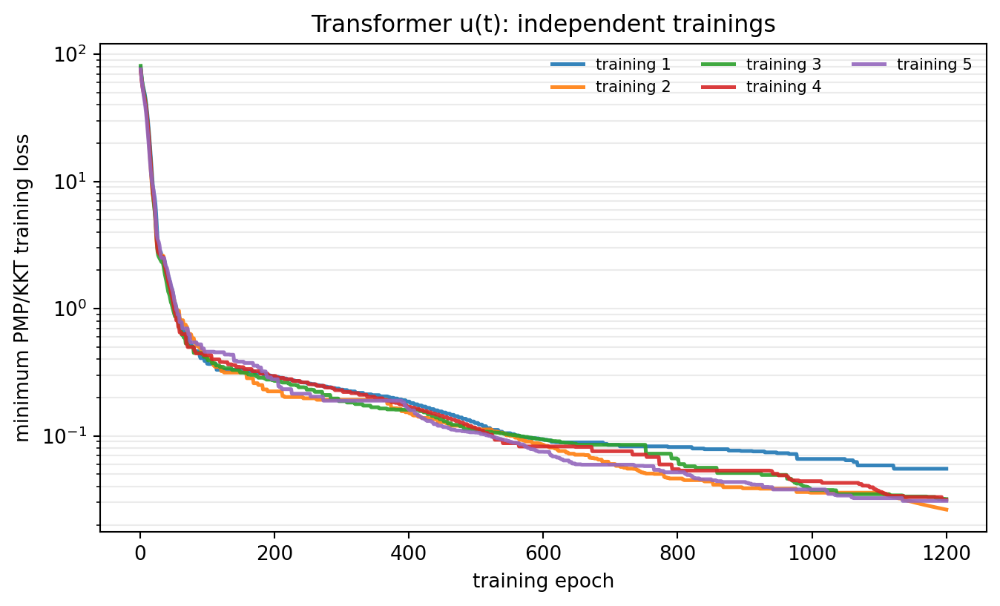
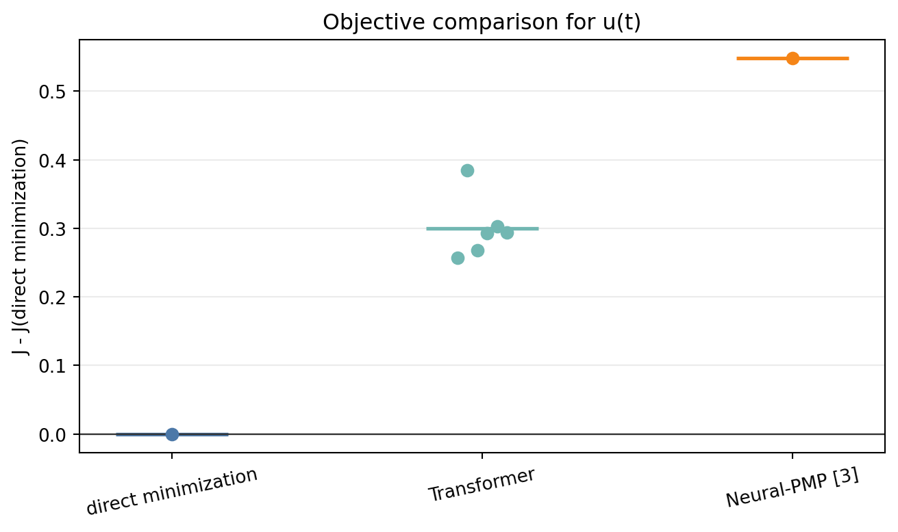
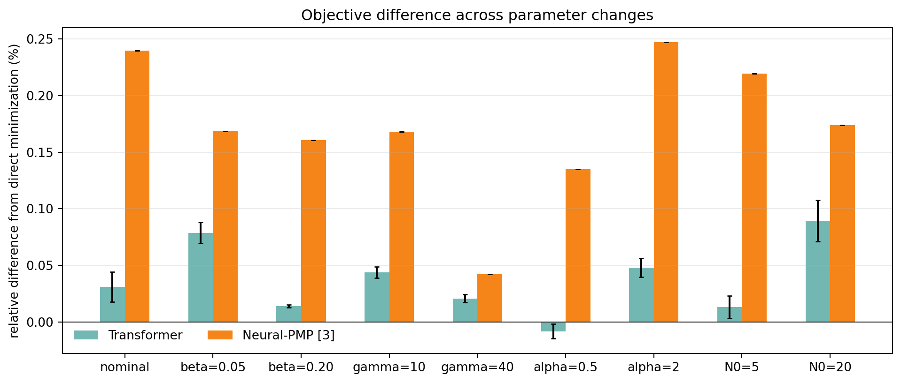
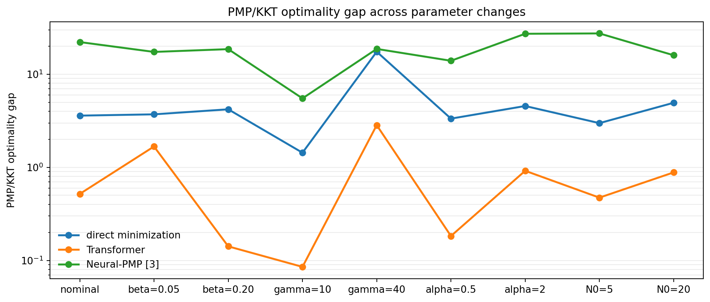

# Transformer \(u(t)\) Reproduction Report

This report focuses on the manuscript's fixed-initial-condition, time-dependent control strategy

$$
u_\theta(t):[0,T]\rightarrow [0,u_{\max}].
$$

The state-dependent feedback extension \(u(t,N)\) is not included here, because that case requires different optimality conditions.

## 1. Model and Training Objective

We use the population dynamics

$$
\dot N_i(t)=\big(r_i-\phi_i u(t)-M_iG(N(t))\big)N_i(t),
\tag{1}
$$

$$
G(N)=\log\left(1+\frac{1}{m}\sum_{k=1}^m N_k\right),
\tag{2}
$$

and the cost

$$
J(u)=\alpha^\top N(T)+\int_0^T\big(\beta^\top N(t)+\gamma u(t)\big)\,dt.
\tag{3}
$$

For the reported run, \(T=10\), \(m=21\), \(u_{\max}=3\), \(\alpha=1\), \(\beta=0.1\), \(\gamma=20\), and \(N_i(0)=10\). The control is represented by a small Transformer encoder over normalized time.

Given \(u_\theta(t)\), we roll out \(N_\theta(t)\), solve the costate equation backward, and compute

$$
\psi(t)=H_u(N,\lambda,u)
=\gamma-\sum_i\phi_i\lambda_i(t)N_i(t).
\tag{4}
$$

The loss has two optimality-condition components:

| component | role |
|---|---|
| non-singular KKT loss | enforces \(u=0\) when \(\psi>0\), and \(u=u_{\max}\) when \(\psi<0\) |
| singular loss | near \(\psi=0\), matches \(u_\theta(t)\) to the singular candidate \(u_{\mathrm{sing}}(N(t))\) |

The total training loss is

$$
\mathcal L
=
\operatorname{mean}\left[
q(t)(u_\theta(t)-u_{\mathrm{sing}}(t))^2
+(1-q(t))\ell_{\mathrm{KKT}}(t)
\right]
+10^{-4}\operatorname{mean}\big[(u_{k+1}-u_k)^2\big].
$$

Here \(q(t)\) is a smooth weight that switches between the singular condition near \(\psi(t)=0\) and the boundary KKT condition away from \(\psi(t)=0\).

## 2. Learned \(u(t)\), \(N(t)\), and \(N(u)\)

The learned control starts high, transitions to a lower interior/singular-like region, and increases again near the terminal portion. The state trajectory decreases substantially from the initial population.

*Figure 1. Learned Transformer control \(u(t)\), population trajectory \(N(t)\), switching function \(\psi(t)\), and singular weight \(q(t)\).*

The \(N(u)\) phase plot below uses the total population across all 21 subpopulations.

*Figure 2. \(N(u)\) phase plot using the total population across the 21 subpopulations.*

## 3. Training Loss Trajectories for PMP/KKT Conditions

The table reports the smallest recorded training loss. In this experiment, the training loss is the manuscript's PMP/KKT optimality gap, composed of the singular condition and the non-singular Hamiltonian minimization condition.

| metric | value |
|---|---:|
| total training loss / PMP-KKT optimality gap | 0.02637 |
| singular-condition training loss | 0.00167 |
| non-singular Hamiltonian-minimization training loss | 0.02471 |
| manuscript objective \(J\), during training | 384.76 |
| range and mean of \(u_\theta(t)\) | min 1.038, max 2.758, mean 1.372 |
| terminal mean state | 1.207 |

The trajectory separates the two optimality conditions in the manuscript. When \(\psi(t)\approx0\), the singular condition is active; when \(\psi(t)\neq0\), the non-singular Hamiltonian minimization condition pushes the control to the appropriate boundary \(0\) or \(u_{\max}\).

*Figure 3. Training trajectories of the total PMP/KKT optimality gap and its singular and non-singular components.*

The next plot shows pointwise PMP/KKT condition components along the final learned trajectory.

*Figure 4. Pointwise singular-condition error and boundary KKT error along the final learned trajectory.*

## 4. Comparison with Related Work

For the fixed-initial-condition \(u(t)\) reproduction, all numerical comparisons keep the same initial condition and compare time-dependent controls \(u(t)\). Several related-work papers in the manuscript target value-function or feedback formulations; those are important related formulations, but they are not the same numerical task as this \(u(t)\) reproduction.

| method family | learned object / formulation | relation to this report |
|---|---|---|
| HJB / BSDE methods [1,2,7] | value function \(V(t,N)\) or HJB PDE solution | state-domain feedback/value formulation; not a direct numerical comparison for fixed \(u(t)\) |
| Neural-PMP [3] | control sequence via forward rollout, backward costate recursion, and Hamiltonian-gradient updates | closest related-work method for the present \(u(t)\) experiment |
| DeepONet / PINN policy iteration [5,6] | policy evaluation and improvement for HJB-type equations | related feedback/value-learning formulation; separate from this fixed-trajectory \(u(t)\) layer |
| classical chemotherapy OC [4] | PMP and singular-control structure | source of the singular-control condition used in the manuscript |

For [3], we compare with the corresponding known-dynamics \(u(t)\) update: forward state integration, backward costate recursion, and Hamiltonian-gradient updates of a discrete control sequence.

| method | optimization condition | objective \(J\)[^1] | \(J-\)direct \(J\) | PMP/KKT gap | role |
|---|---|---:|---:|---:|---|
| direct minimization of \(J\) | minimize discretized \(J\) on a time mesh | 386.438 | 0.000 | 1.016 | cost comparison |
| Transformer \(u(t)\), six trainings | manuscript PMP/KKT optimality-gap loss | 386.738 +/- 0.045 | 0.300 +/- 0.045 | 0.463 +/- 0.148 | reproduction |
| best Transformer training | same as above | 386.695 | 0.257 | 0.207 | best Transformer result |
| Neural-PMP [3] | PMP-gradient update for \(u(t)\) with known dynamics | 386.986 | 0.548 | 8.574 | related-work comparison |
| constant \(u=1.5\) | fixed control | 400.403 | 13.965 | 76.556 | simple control |
| provided repository output | provided `s.csv` | 422.670 | 36.232 | 433.349 | provided output file |

[^1]: For comparison, after \(u(t)\) is fixed, \(N(t)\) and \(J\) are recomputed on a common fine time mesh using fourth-order Runge-Kutta. This is only the numerical evaluation of the manuscript objective.

*Figure 5. Convergence of the Transformer \(u(t)\) PMP/KKT training loss across independent trainings.*

*Figure 6. Difference in \(J\) from direct minimization for the main \(u(t)\) comparison.*

*Figure 7. Neural-PMP [3]: control sequence and resulting state trajectory.*

*Figure 8. Neural-PMP [3]: selected training trajectories.*

## 5. Parameter Sensitivity

We also tested whether the \(u(t)\) reproduction is tied to the nominal parameter choice. In each row below, one parameter is changed while the others remain at the reported setting. The Transformer result is averaged over three independent trainings; Neural-PMP [3] is the best result from the same search protocol.

| condition | direct \(J\) | Transformer \(J\) | Transformer gap | Neural-PMP gap |
|---|---:|---:|---:|---:|
| nominal | 386.706 | 386.826 +/- 0.052 | 0.031% | 0.240% |
| \(\beta=0.05\) | 325.457 | 325.713 +/- 0.030 | 0.079% | 0.169% |
| \(\beta=0.20\) | 444.860 | 444.923 +/- 0.006 | 0.014% | 0.160% |
| \(\gamma=10\) | 230.385 | 230.485 +/- 0.011 | 0.044% | 0.168% |
| \(\gamma=40\) | 614.915 | 615.043 +/- 0.021 | 0.021% | 0.042% |
| \(\alpha=0.5\) | 370.513 | 370.482 +/- 0.023 | -0.008% | 0.135% |
| \(\alpha=2\) | 404.406 | 404.600 +/- 0.033 | 0.048% | 0.247% |
| \(N_0=5\) | 371.118 | 371.168 +/- 0.037 | 0.013% | 0.220% |
| \(N_0=20\) | 404.839 | 405.201 +/- 0.074 | 0.089% | 0.174% |

In this sensitivity table, direct \(J\) is obtained by direct minimization on an \(n=400\) time mesh and then recomputed on the common fine time mesh. The small negative \(\alpha=0.5\) gap is within this numerical tolerance and should be read as a tie, not as beating the optimum.

Across these one-factor tests, the Transformer remains within about 0.09% of direct minimization. Neural-PMP [3] is also close in objective value, but the Transformer is consistently closer to direct minimization and has a smaller PMP/KKT optimality gap.

*Figure 9. Difference in objective \(J\) from direct minimization across parameter and initial-condition changes.*

*Figure 10. PMP/KKT optimality gap across the same sensitivity conditions.*

## 6. Conclusion

The requested \(u(t)\) reproduction is complete. The Transformer control trained with the manuscript's PMP/KKT optimality-gap loss is smooth, satisfies the control bounds, and reduces the training optimality gap from about 76 to 0.026 in the best training. Across six Transformer trainings in the nominal setting, the recomputed objective is \(386.738\pm0.045\), close to direct minimization of \(J\) at \(386.438\) and better than Neural-PMP [3] in this comparison. The parameter sensitivity experiments further show that the same \(u(t)\) training procedure remains close to direct minimization under changes in \(\beta\), \(\gamma\), \(\alpha\), and \(N_0\).
